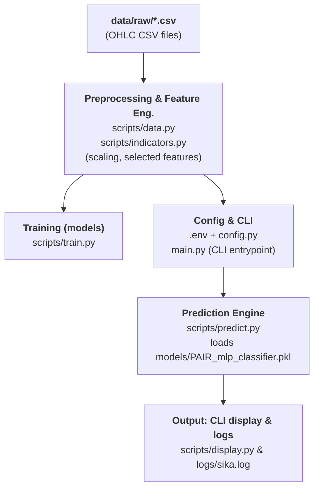

# Sika

Sika is being rebuilt as a research-validated `XAUUSDm` trade-plan system using
the Exness MT5 execution feed. The current milestone is strictly read-only market
data acquisition and validation; it does not place trades or publish signals.

Current project documents:

- [`PLAN.md`](PLAN.md) — staged delivery and promotion gates.
- [`docs/research-contract.md`](docs/research-contract.md) — normative v0 research
  and risk decisions.
- [`docs/operations/mt5.md`](docs/operations/mt5.md) — MT5/Wine operating runbook.

New implementation lives under `src/sika/` and `mt5/`. The original daily
direction application is preserved below as historical baseline code only. Its
models, accuracy claims, commands, and outputs are not approved for research,
paper signals, or trading decisions.

## Preserved legacy baseline

> **Unsupported for decision use:** the following sections document the original
> project and are retained only so its behavior remains reproducible.

[](https://python.org)
[](https://scikit-learn.org)
[](.)
[](.)

---

## 🎯 Overview

**Sika** is a machine learning system designed to predict foreign exchange and commodity market trends using neural networks and technical indicators. Built as a local-first CLI application, it provides a clean, intuitive interface for training models, making predictions, and tracking metrics.


---

## ✨ Features

### Technical Features

- **Feature Engineering**: TTM Trend, MACD, RSI, ADX, Stochastic RSI, and INC/DEC
- **Model Architecture**: Multi-layer perceptron
- **Data Processing**: Min-Max Scaling
- **Model Persistence**: Serialized models and scalers as .pkl files
- **Comprehensive Logging**: Logging with detailed execution traces

---

## 📊 Project Metrics

### Performance Characteristics

| Metric | Value |
|--------|-------|
| **Model Type** | Multi-Layer Perceptron Classifier |
| **Training Algorithm** | L-BFGS Optimizer |
| **Default Iterations** | 10,000 |
| **Feature Count** | 7 technical indicators |
| **Train/Test Split** | 80/20 |
| **Typical Accuracy** | 80-90% (market-dependent) |

### Stack Overview

```
Python 3.12.9
├── Data Processing
│   ├── pandas (2.3.3)
│   └── numpy (2.3.4)
├── Machine Learning
│   ├── scikit-learn (1.7.2)
│   ├── scipy (1.17.1)
│   └── ta-lib (0.6.8)
└── CLI & Display
    ├── rich (14.2.0)
    └── colorama (0.4.6)
```

---

## 🚀 Quick Start

### Prerequisites

- Python 3.12.9
- uv package manager

### Installation

```bash
# Clone or download the repository
git clone <repository-url>
cd sika

# Create virtual environment
uv sync

# Install dependencies
uv pip install -r requirements.txt

# Create configuration file
cp .env.example .env
```

### Your First Prediction

```bash
# Start interactive mode (recommended)
uv run main.py

# Or run directly
uv run main.py --mode predict --pair XAUUSD --open 2650.50
```

---

## ⚙️ Configuration

### Environment Variables

Create a `.env` file in the project root:

```bash
# Data Directories
RAW_DATA_DIR=data/raw
PROCESSED_DATA_DIR=data/processed
MODEL_DIR=models
LOGS_DIR=logs

# Trading Pairs (comma-separated)
TRADING_PAIRS=XAUUSD,EURUSD,GBPUSD

# Data Configuration
START_DATE=2020-01-01
RANDOM_STATE=42

# Model Hyperparameters
TRAIN_SPLIT=0.8
ACTIVATION=logistic
SOLVER=lbfgs
LEARNING_RATE=adaptive
LEARNING_RATE_INIT=0.03
MAX_ITER=10000
MOMENTUM=0.2
EARLY_STOPPING=True

# Feature Selection
SELECTED_FEATURES=TTM_TRND_6,MACD_12_26_9,RSI_14,ADX_14,STOCHRSIk_10_14_3_3,INC_1,DEC_1

TIINGO_KEY = your_tiingo_api_key
```

---

## 🏗️ Architecture

### System Pipeline



- High-level pipeline: raw data → preprocessing & indicators → train → model artifacts → prediction → CLI display & logs.

---

## 📁 Project Structure

```
sika/
├── main.py                 # CLI entry point
├── config.py              # Configuration management
├── pyproject.toml         # Project metadata
├── requirements.txt       # Python dependencies
│
├── scripts/               # Core modules
│   ├── __init__.py
│   ├── train.py          # Training pipeline
│   ├── predict.py        # Prediction engine
│   ├── data.py           # Data loading & preprocessing
│   ├── indicators.py     # Technical indicators
│   ├── log.py            # Accuracy logging
│   ├── logger.py         # File logging setup
│   └── display.py        # CLI display utilities
│
├── data/                 # Data storage
│   ├── raw/              # Original OHLC data (CSV)
│   └── processed/        # Processed features
│
├── models/               # Model persistence
│   ├── PAIR_mlp_classifier.pkl
│   ├── PAIR_scaler.pkl
│   └── PAIR_metadata.json
│
└── logs/                 # Execution logs
    └── sika.log
```

---

## 📈 Technical Indicators

Sika uses 7 strategically selected technical indicators:

### 1. **TTM Trend (6-period)**
- Measures trend strength
- Input: Last 6 candles
- Output: Scaled trend intensity

### 2. **MACD (12, 26, 9)**
- Momentum oscillator
- Parameters: Fast=12, Slow=26, Signal=9
- Captures trend changes and momentum

### 3. **RSI (14-period)**
- Relative Strength Index
- Range: 0-100 (Overbought/Oversold)
- Identifies reversal opportunities

### 4. **ADX (14-period)**
- Average Directional Index
- Measures trend strength
- Range: 0-100 (Strong/Weak)

### 5. **Stochastic RSI**
- RSI applied to RSI values
- Period: 10, Smoothing: 3
- Momentum confirmation

### 6. **Price Increase Ratio (INC_1)**
- Percentage of up candles
- 1-period lookback
- Recent bullish pressure

### 7. **Price Decrease Ratio (DEC_1)**
- Percentage of down candles
- 1-period lookback
- Recent bearish pressure

---

## 🔧 Customization

### Adding New Trading Pairs

1. Update `.env` configuration:
   ```bash
   TRADING_PAIRS=XAUUSD,EURUSD,YOUR_NEW_PAIR
   ```

2. Train model:
   ```bash
   python main.py --mode train --pair YOUR_NEW_PAIR
   ```

### Modifying Technical Indicators

Edit `scripts/indicators.py` to add or modify indicators:

```python
def custom_indicator(df):
    """Add your custom indicator here"""
    return calculated_values
```

Then update `SELECTED_FEATURES` in `.env`.

### Tuning Model Hyperparameters

Modify `.env` values:

```bash
# For more training: increase MAX_ITER
MAX_ITER=15000

# For faster convergence: adjust learning rate
LEARNING_RATE_INIT=0.05

# For stronger regularization: increase MOMENTUM
MOMENTUM=0.5
```

---

## 📊 Model Performance

### Typical Characteristics

- **Accuracy Range**: 80-90% (market-dependent)
- **Training Time**: 30-120 seconds per pair
- **Prediction Latency**: <100ms
- **Memory Footprint**: 100-200MB per session
- **Data Requirements**: 3-5 years historical data

> **Note**: Accuracy depends heavily on market conditions, pair volatility, and indicator stability. Regular retraining recommended when market regimes change.

---

## 🐛 Troubleshooting

### Issue: "Model not found for pair"
```bash
# Solution: Train the model first
python main.py --mode train --pair XAUUSD
```

### Issue: "Insufficient data"
```bash
# Solution: Ensure raw CSV exists in data/raw/
# Format should be: PAIRRAW.csv
# Example: XAUUSDRAW.csv
```

### Issue: "Feature mismatch during prediction"
```bash
# Solution: Retrain model with current indicators
python main.py --mode train --pair XAUUSD
```

### Issue: High memory usage
```bash
# Solution: Reduce MAX_ITER in .env
MAX_ITER=5000
```

### Issue: Import errors
```bash
# Solution: Reinstall dependencies
pip install -r requirements.txt
```

---

## 🎯 Use Cases

### Portfolio Analysis
Monitor multiple forex pairs and commodities with consistent ML-based analysis.

### Strategy Development
Test trading ideas and validate signals against historical predictions.

### Risk Analysis
Identify trend changes early with high-accuracy predictions.

### Market Learning
Understand technical analysis and ML applications in finance.

### Data Exploration
Analyze market patterns and indicator relationships.

---

## 🏆 Tips for Best Results

1. **Use Quality Data**: Ensure OHLC data is complete and accurate
2. **Retrain Regularly**: Models degrade over time as market conditions change
3. **Verify Predictions**: Log actual results to track accuracy
4. **Test Thoroughly**: Backtest strategies before live use
5. **Monitor Accuracy**: Track metrics over time to catch degradation
6. **Optimize Hyperparameters**: Experiment with different settings for your pairs
7. **Handle Missing Data**: Clean data before training

---

## 📚 Technical Stack

| Component | Version | Purpose |
|-----------|---------|---------|
| Python | 3.12.9 | Runtime environment |
| scikit-learn | 1.7.2 | Machine learning |
| pandas | 2.3.3 | Data manipulation |
| numpy | 2.3.4 | Numerical computing |
| ta-lib | 0.6.8 | Technical analysis |
| rich | 14.2.0 | Terminal UI |
| joblib | 1.5.3 | Model serialization |
| python-dotenv | 1.2.2 | Configuration |

---

## 📞 Support

For questions or issues:
reachout at: newmankelvin14@gmail.com

---

## ⚠️ Disclaimer

**Sika is provided for educational and research purposes only.** Trading in financial markets carries substantial risk of loss. Past performance is not indicative of future results. Always conduct thorough backtesting and due diligence before using predictions for live trading. The authors are not responsible for trading losses or decisions made based on predictions from this system.


---

⭐ If you find this project useful, consider giving it a star!
